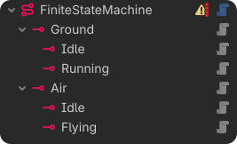
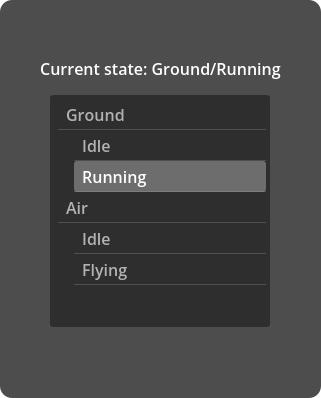
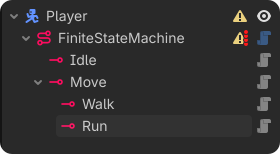
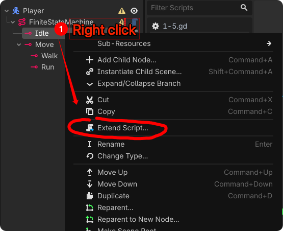

 
# Godot Finite State Machine (FSM)

 A better state machine for Godot 4.x (GDScript). Nesting states supported. Designed with developer experience in mind, this plugin provides editor warnings, automated tree scanning, hierarchical lifecycle propagation, and runtime flexibility for both static and dynamic setups.

 
 

## Features

- **Hierarchical/Nested FSM**: Build nested state structures naturally using Godot's Scene Tree.
- **Tree-based Automation**: Automatically registers states, establishes back-references, and assigns IDs using their tree paths (e.g., `Idle`, `Move/Walk`, `Move/Run`).
- **Lifecycle Propagation**: Seamlessly calls `enter`, `exit`, `update`, and `physics_update` through the hierarchy using upward/downward call propagation.
- **Editor Integration**: Extends `@tool` script behavior and utilizes `_get_configuration_warnings()` to safely guide configuration in the Godot Editor.
- **Runtime Flexibility**: Dynamically registers states at runtime if you add new `State` nodes while the game is running.

---

## Installation

1. Clone or download this repository.
2. Copy the `addons/finite_state_machine` folder into your project's `res://addons/` directory.
3. Go to **Project -> Project Settings -> Plugins** and enable **Finite State Machine**.

---

## Getting Started

### 1. Add to your scene tree



- Add a `FiniteStateMachine` node to your character/entity.
- Add your `State` nodes as children of the `FiniteStateMachine` node.
- Rename `State` nodes as state IDs.
- Assign the `Initial State` property in the Inspector for your `FiniteStateMachine`(optional).

**Example Hierarchy:**

```text
Player (CharacterBody2D)
└── FiniteStateMachine (Assign initial_state -> Idle)
    ├── Idle (Node, script extends State)
    └── Move (Node, script extends State)
        ├── Walk (Node, script extends State)
        └── Run (Node, script extends State)

```

### 2. Extends state script



Extend it for specific behaviors, right-clicking a Node and choosing **Extend Script**

- Right click state node
- Click "Extend script"
- Save it wherever you want. E.g. "res://player/states/idle.gd"


```gdscript
# res://player/states/idle.gd
# class_name is optional
class_name Idle
extends State

func enter() -> void:
	print("Entering Idle State")
	# Play idle animation here

func update(delta: float) -> void:
	if player.velocity.length() > 0:
		# Transition using the state's ID or ID path if nested
		transition("Move/Walk")

```

---

## Core Concepts

### Hierarchical Path IDs

State IDs are determined automatically by their relative paths to the `FiniteStateMachine` node. For the hierarchy above, the registered IDs are:

* `"Idle"`
* `"Move"`
* `"Move/Walk"`
* `"Move/Run"`

### Upward & Downward Call Propagation

When switching states, the FSM uses bubble-up (`_state_up_call`) and trickle-down (`_state_down_call`) strategies:

* **`transition("Move/Walk")`**: Triggers `exit` up to the root from the previous state, and propagates `enter` down through the target path (e.g., calling `enter` on `Move` then `Walk`).
* **`_process` & `_physics_process**`: Automatically proxies down `update(delta)` and `physics_update(delta)` calls to the currently active state and its nested children.

---

## API Reference

### `FiniteStateMachine`

#### Properties

* `initial_state: State`: The state the machine automatically starts with when the game begins.
* `current_state: State`: The currently active state.

#### Signals

* `transitioned(from: State, to: State)`: Emitted when a state transition successfully occurs.

#### Methods

* `transition(to_id: String)`: Transitions the machine to the target state specified by its path ID string.

---

## License

This project is licensed under the MIT License.
